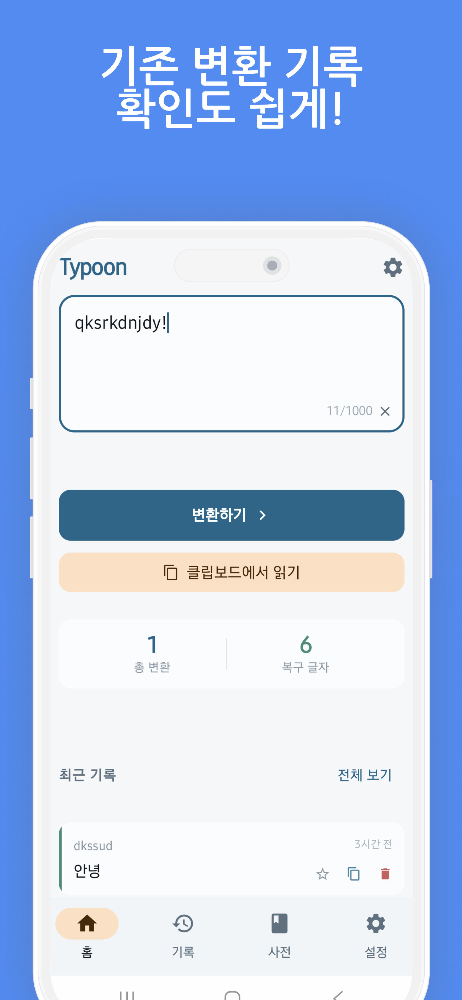
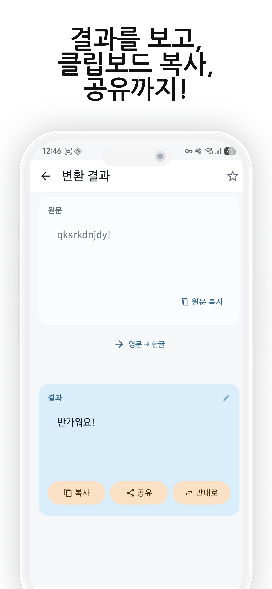
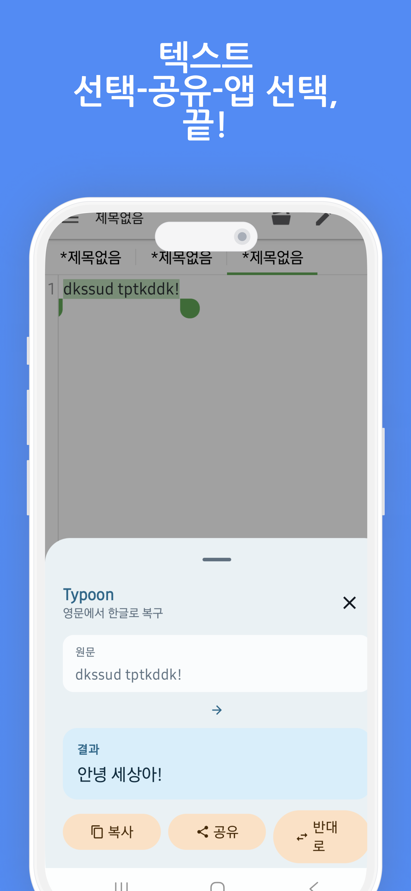

<a id="readme-top"></a>

<div align="center">

# Typoon

[](https://developer.android.com)
[](https://kotlinlang.org)
[](https://developer.android.com/jetpack/compose)
[](https://m3.material.io)
[](./LICENSE)

한글/영문 키보드가 잘못 전환된 문장을 빠르게 복구하는 Android 앱

텍스트를 붙여넣거나, 클립보드에서 불러오거나, 다른 앱의 공유 메뉴에서 바로 넘겨 받아
자연스러운 방향으로 다시 변환합니다.

</div>

## Table of Contents

- [About The Project](#about-the-project)
  - [Why Typoon](#why-typoon)
  - [Key Features](#key-features)
  - [Built With](#built-with)
- [Screenshots](#screenshots)
- [Download](#download)
- [Getting Started](#getting-started)
  - [Development Environment](#development-environment)
  - [Installation](#installation)
- [Usage](#usage)
- [Testing](#testing)
- [Project Structure](#project-structure)
- [Privacy](#privacy)
- [Release Notes](#release-notes)
- [Contributing](#contributing)
- [License](#license)

## About The Project

Typoon은 한글/영문 키보드 전환이 잘못된 문장을 기기 안에서 빠르게 복구하는 온디바이스 텍스트 변환 앱입니다.

입력 텍스트를 분석하여 `영문 -> 한글`, `한글 -> 영문` 방향을 추론하고, 홈 입력창뿐 아니라 공유 시트, `PROCESS_TEXT`, 퀵 설정 타일 등 여러 진입점에서 바로 사용할 수 있습니다. 또한 변환 기록, 즐겨찾기, 예외 단어 사전, CSV 내보내기 기능을 포함하여 단순 변환 도구를 넘어 일상적인 텍스트 복구 흐름을 지원합니다.

<p align="right">(<a href="#readme-top">맨 위로</a>)</p>

### Why Typoon

- 잘못 전환된 키보드 입력을 빠르게 복구할 수 있습니다.
- 핵심 변환 기능이 기기 안에서 동작하여 네트워크 의존성이 낮습니다.
- 홈 화면, 공유 메뉴, 선택 텍스트 처리, 퀵 설정 등 다양한 진입점을 제공합니다.
- 기록 관리, 즐겨찾기, 예외 단어, 내보내기 기능으로 반복 사용에 적합합니다.
- 입력과 기록을 로컬 중심으로 처리하는 프라이버시 지향 구조를 갖습니다.

### Key Features

- 잘못 입력된 한글/영문 문장을 빠르게 변환
- 최근 클립보드 텍스트를 바로 읽어 와서 즉시 복구
- 다른 앱의 공유 메뉴에서 Typoon으로 텍스트 전달
- Android `PROCESS_TEXT` 액션으로 선택 텍스트 교체
- 퀵 설정 타일로 클립보드 내용 바로 변환
- 변환 기록 저장, 검색, 즐겨찾기 관리
- 예외 단어를 등록해 특정 단어는 변환 대상에서 제외
- 결과 공유 시 출처 문구 추가 옵션 제공
- 변환 기록 전체 CSV 내보내기 지원
- 입력과 기록을 로컬에서 처리하는 프라이버시 중심 설계

### Built With

- Kotlin
- Jetpack Compose
- Material 3
- Navigation Compose
- Hilt
- Room
- DataStore
- KSP
- ktlint
- detekt
- JUnit4

<p align="right">(<a href="#readme-top">맨 위로</a>)</p>

## Screenshots

> 아래 이미지는 예시 경로입니다. 실제 스크린샷 파일을 추가한 뒤 경로만 교체하면 됩니다.

| Home | Result | Quick View |
| --- | --- | --- |
|  |  |  |

<p align="right">(<a href="#readme-top">맨 위로</a>)</p>

## Download

### Play Store

<a src="https://play.google.com/store/apps/details?id=xyz.gaon.typoon"></a>

### APK

플레이스토어에서 설치하는 것을 권장합니다만 `apk` 파일이 필요한 경우, 언제든지 릴리즈 페이지에서 다운로드 받으실 수 있습니다.

- [Latest Release](../../releases/latest)

### Build It Yourself

Windows:

```powershell
.\gradlew.bat assembleDebug
```

macOS / Linux:

```bash
./gradlew assembleDebug
```

생성된 APK는 일반적으로 아래 경로에서 확인할 수 있습니다.

```text
app/build/outputs/apk/debug/
```

<p align="right">(<a href="#readme-top">맨 위로</a>)</p>

## Getting Started

### Development Environment

- Android Studio 최신 안정 버전 권장
- JDK 11
- Android SDK
  - `compileSdk = 36`
  - `targetSdk = 36`
  - `minSdk = 26`

### Installation

#### Android Studio

1. 프로젝트를 Android Studio에서 엽니다.
2. Gradle Sync를 완료합니다.
3. 에뮬레이터 또는 실제 기기를 선택합니다.
4. `app` 구성을 실행합니다.

#### Command Line

Windows:

```powershell
.\gradlew.bat installDebug
```

macOS / Linux:

```bash
./gradlew installDebug
```

<p align="right">(<a href="#readme-top">맨 위로</a>)</p>

## Usage

Typoon은 여러 방식으로 사용할 수 있습니다.

### 1. 홈 화면에서 직접 변환

앱을 실행한 뒤 텍스트를 입력하거나 붙여넣고 바로 변환할 수 있습니다.

### 2. 클립보드에서 불러오기

최근 복사한 텍스트를 홈 화면에서 곧바로 읽어 와 복구할 수 있습니다.

### 3. 다른 앱에서 공유

다른 앱에서 텍스트를 선택한 뒤 공유 메뉴를 통해 Typoon으로 전달할 수 있습니다.

### 4. 선택 텍스트 바로 교체

Android `PROCESS_TEXT` 기능을 통해 선택한 텍스트를 더 빠르게 교체할 수 있습니다.

### 5. 퀵 설정 타일 사용

퀵 설정 타일을 통해 클립보드 텍스트를 더욱 빠르게 변환할 수 있습니다.

### 6. 기록 관리와 내보내기

변환 기록을 검색하거나 즐겨찾기로 관리할 수 있으며, 전체 기록을 CSV로 내보낼 수 있습니다.

<p align="right">(<a href="#readme-top">맨 위로</a>)</p>

## Testing

Windows:

```powershell
.\gradlew.bat testDebugUnitTest
.\gradlew.bat ktlintCheck
.\gradlew.bat detekt
```

macOS / Linux:

```bash
./gradlew testDebugUnitTest
./gradlew ktlintCheck
./gradlew detekt
```

핵심 변환 로직 테스트는 아래 파일에 포함되어 있습니다.

```text
app/src/test/java/xyz/gaon/typoon/core/engine/ConversionEngineTest.kt
```

<p align="right">(<a href="#readme-top">맨 위로</a>)</p>

## Project Structure

```text
app/src/main/java/xyz/gaon/typoon
|- core
|  |- engine       # 한영 오타 변환 엔진
|  |- data         # Room / DataStore / repository
|  |- export       # CSV 내보내기
|  |- clipboard    # 클립보드 처리
|  `- tile         # 퀵 설정 타일
|- feature
|  |- home
|  |- result
|  |- history
|  |- dictionary
|  |- settings
|  |- onboarding
|  `- splash
|- navigation      # 앱 라우팅
`- ui              # 공통 컴포넌트와 테마
```

<p align="right">(<a href="#readme-top">맨 위로</a>)</p>

## Privacy

Typoon은 프라이버시 중심 설계를 지향합니다.

- 기본 텍스트 변환은 온디바이스에서 수행됩니다.
- 입력 텍스트와 변환 기록은 로컬 저장소에서 관리됩니다.
- 네트워크 연결 없이도 핵심 변환 기능을 사용할 수 있습니다.
- 민감한 텍스트를 외부 서버로 보내지 않는 기본 흐름을 목표로 합니다.

<p align="right">(<a href="#readme-top">맨 위로</a>)</p>

## Contributing

개선 제안, 버그 제보, 기능 제안은 언제든지 환영합니다.

1. 저장소를 포크합니다.
2. 기능 브랜치를 생성합니다.
3. 변경 사항을 커밋합니다.
4. 브랜치에 푸시합니다.
5. Pull Request를 생성합니다.

Issue나 Pull Request를 열기 전, 재현 방법과 기대 동작을 함께 정리해 주시면 더 빠르게 검토할 수 있습니다.

또는 기부도 환영입니다! [Github Sponsers](https://github.com/sponsors/gaon12)에서 원하시는 만큼 해주시면 감사하겠습니다. 앱 내부에 기록해 드리겠습니다!

<p align="right">(<a href="#readme-top">맨 위로</a>)</p>

## License

이 프로젝트는 [MIT License](./LICENSE)를 따릅니다.

<p align="right">(<a href="#readme-top">맨 위로</a>)</p>
